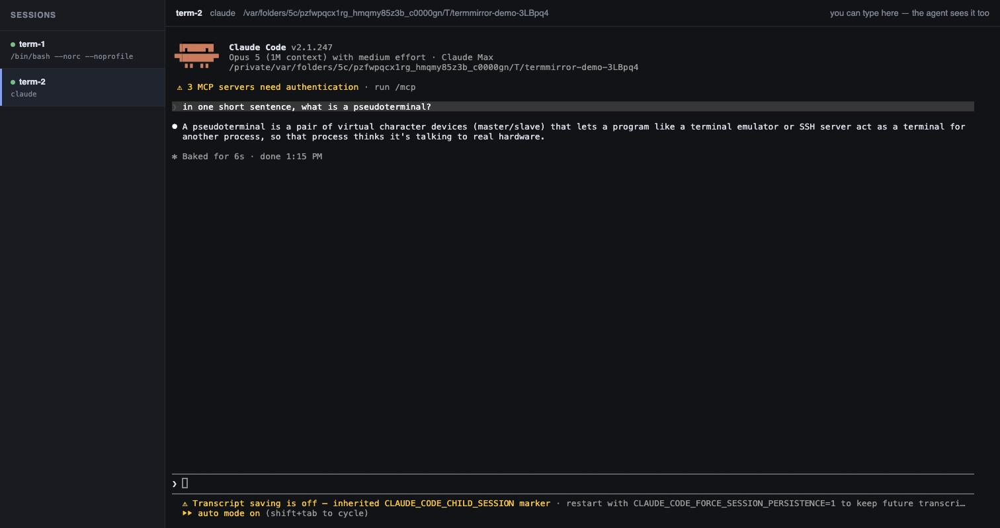
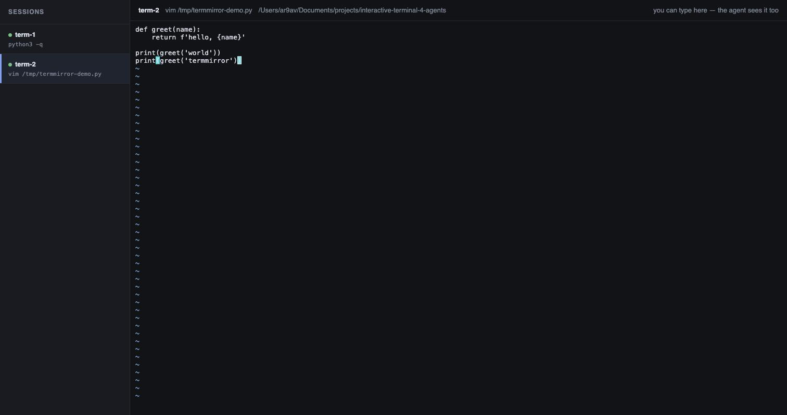

# termmirror

An MCP server that gives AI agents real interactive terminal sessions — and a live web view
where a human can watch those sessions and type into them.

Most agent tooling can only run commands that exit on their own. Anything that prompts,
redraws, or waits for a keystroke is out of reach: installers, `ssh` with a password
challenge, `pdb`, `vim`, a package manager's configuration screen — and another agent's CLI.
termmirror keeps real PTY sessions open so an agent can work them the way a person does, one
keystroke at a time, while a human can look over its shoulder and step in when needed.



*One agent driving a Claude Code session through termmirror — it accepted the trust prompt,
asked a question, and read the answer off the screen. The browser view is live, and typing in
it goes straight to the same terminal.*



*A full-screen TUI under the same tools: the agent opened `vim`, moved to the end of the
file, entered insert mode, and typed a line.*

## Features

- **Real PTY sessions.** Backed by `node-pty` with a headless terminal emulator holding
  screen state. No `tmux` or other external dependency.
- **Built for TUIs.** Alternate-screen detection, key encoding for control and navigation
  keys, and scrollback that unwraps soft-wrapped lines.
- **Reliable waiting.** `wait` returns once a program has responded *and* settled, so the
  screen you read reflects your input rather than the state before it.
- **Live web view.** Any session can be watched in the browser as it runs. Typing in the
  page goes straight to the PTY, so a human can take over and hand back.
- **Agent-to-agent.** Designed so one agent can drive another agent's CLI through a
  multi-turn conversation.
- **Browser sessions too.** The same three properties for a real Chrome window: the agent
  drives it by accessibility ref, a human watches and clicks in the web view, and the whole
  thing records.
- **Recordable.** Any session can be recorded in the background and exported as a GIF, an
  mp4, or an asciicast, which makes demoing a terminal workflow a two-tool-call job.

## Requirements

- Node.js 20 or newer
- macOS or Linux

## Installation

```bash
npm install termmirror
```

Or from source:

```bash
git clone https://github.com/Ar9av/termmirror.git
cd termmirror
npm install && npm run build
```

termmirror repairs node-pty's helper permissions at runtime, so `--ignore-scripts` costs
nothing on macOS and Windows, where node-pty ships a prebuilt binding.

On Linux there is no prebuilt binding — node-pty compiles one from its own install script.
With `ignore-scripts=true` (npm v12's default, and a common hardening setting) that is
skipped silently, and the first session fails with `Failed to load native module: pty.node`.
Build it once with `npm rebuild node-pty --foreground-scripts`, which needs `make`, `g++`
and `python3`.

Register the server with Claude Code:

```bash
claude mcp add --scope user termmirror -- node /absolute/path/to/termmirror/dist/src/index.js
```

`--scope user` matters: without it the server is registered for the current project only,
and the tools are missing from every other one. The `.mcp.json` in this repo is the same
kind of project-scoped registration — it serves the repo's own development, needs
`npm run build` to have run, and Claude Code asks to approve it the first time.

Any MCP client works; the server speaks stdio.

## Usage

Three tools, used in this order:

```
send_input  →  wait  →  read_screen
```

`read_screen` returns the screen as it looks now — a screenshot, not a log of everything
printed. `wait` is what makes that screenshot worth reading: it blocks until the program has
responded and gone quiet, so you see the state *after* your keystroke.

### Tools

| Tool | Description |
| --- | --- |
| `create_session` | Starts a session (`$SHELL` by default, or any command) and returns its id plus a URL to watch it. |
| `send_input` | Types text into a session, optionally submitting it with Enter. |
| `send_keys` | Sends `ctrl+c`, `escape`, `tab`, arrow keys, `f1`–`f12`, `alt+X`, and similar. |
| `read_screen` | Returns the visible screen as plain text; `scrollback` reaches into history. |
| `wait` | Waits for the session to respond and settle (`idle`), or for text to appear (`pattern`). |
| `list_sessions` | Lists all sessions, alive or exited, with watch URLs. |
| `resize` | Changes the terminal dimensions. |
| `start_recording` | Begins capturing the session's output in the background. |
| `stop_recording` | Finishes the recording and renders it to GIF, mp4, or asciicast. |
| `browser_open` | Launches a Chrome window the agent drives, and returns a URL to watch it. |
| `browser_navigate` | Loads a URL and returns the page snapshot. |
| `browser_snapshot` | Returns the page as an accessibility tree with a `[ref=eN]` per element. |
| `browser_act` | Clicks, types, presses, hovers, selects, scrolls or uploads, and returns the new snapshot. |
| `browser_tabs` | Lists, switches, opens and closes tabs. |
| `browser_wait` | Waits for the network to settle, or for text to appear on the page. |
| `kill_session` | Terminates a session, terminal or browser. |

### Waiting

`idle` is the default and the right choice in most cases. Interactive programs redraw
continuously while they work and fall silent when it is your turn, so silence is a reliable
completion signal — including for spinners and TUIs that expose no prompt to match against.
Increase `timeout` for slow operations.

A `no_output` result means nothing came back since your input: the program is either busy and
silent, or the input never registered.

Use `pattern` when the expected text is known. It matches against the whole screen, including
your own echoed input, so wait for something the *program* prints rather than a marker you
just typed.

## Watching a session

The first session starts a local web server on port 7878, or the next free port if something
is already there — most often a termmirror that outlived its client. Open the URL returned by
`create_session` to see the session live. Typing in the page writes directly to the PTY,
which lets a human enter a password or answer a prompt the agent should not handle, then hand
control back — no handoff protocol, just the same terminal from the other side.

| Variable | Effect |
| --- | --- |
| `TERMINAL_UI_PORT` | Port for the web view. Set explicitly, a busy port is an error rather than a fallback; `0` picks a free port. |
| `TERMINAL_NO_UI` | Set to `1` to disable the web view entirely. |

## Browser sessions

A browser is the same kind of session as a terminal, under its own tools:

```
browser_open  →  browser_act  →  (browser_act again)
```

`browser_act` returns the page snapshot it produced, so one call per step is usually enough.
The snapshot is an accessibility tree rather than a picture:

```
- heading "Example Domain" [level=1] [ref=e2]
- link "More information..." [ref=e4]
```

Every element carries a `[ref=eN]`, and `browser_act` targets those refs — or a CSS selector,
if that is easier. This is what makes a click deterministic: no coordinates to guess and
nothing for a vision model to misread. Pass `screenshot: true` to `browser_snapshot` when the
layout itself is the question.

A big page is cut at about 4k tokens, with a note saying how much was left out — a news front
page is three times that in full and a Wikipedia article eight times, and every action returns
a snapshot. `depth` shows the whole page in less detail; `full: true` returns all of it.

termmirror drives the Google Chrome already installed on the machine and never downloads a
browser of its own. The window is visible by default; pass `headless` on a server. Pass
`profile` to reuse a named profile under `~/.termmirror/profiles`, which keeps logins between
sessions — one session at a time per profile, since Chrome will not open a profile twice.

A browser session appears in the web view like any other, as a live image of the page. Clicks,
scrolls and keystrokes in that image go to the same page the agent is driving, so a human can
solve a login or a CAPTCHA and hand straight back.

### Tabs, dialogs, downloads and uploads

A click that opens a new tab switches to it and returns that tab's snapshot, because that is
invariably what the click was for and an agent left talking to the page underneath has no way
to notice. `browser_tabs` goes back, opens another, or closes one; the snapshot says which tab
it came from whenever more than one is open.

A dialog freezes the page until it is answered, so the answer cannot be decided after the fact.
Set `dialog` on the `browser_act` call that raises one, with `dialog_text` for a `prompt()`.
Anything unanswered is dismissed, and the next snapshot reports what the dialog said and what
was done with it.

Downloads are saved under `~/.termmirror/downloads/<session>/` and named in the next snapshot.
Uploads are `browser_act` with kind `upload` and a list of local `files`.

## Recording a session

`start_recording` captures everything the session prints from that point on, passively, while
the agent keeps driving it as usual. `stop_recording` finishes the capture and renders it:

```
start_recording  →  (drive the session)  →  stop_recording
```

Recordings are written as [asciicast v2](https://docs.asciinema.org/manual/asciicast/v2/)
(`.cast`) under `~/.termmirror/recordings/` unless a `path` is given. A `.cast` is a complete
recording on its own — `asciinema play file.cast` replays it — and `stop_recording` renders it
to a shareable file:

| `format` | Output | Needs |
| --- | --- | --- |
| `gif` (default) | Animated GIF | [`agg`](https://github.com/asciinema/agg) |
| `mp4` | H.264 video | `agg` and `ffmpeg` |
| `cast` | The asciicast only | nothing |

```bash
brew install agg ffmpeg   # or: cargo install --git https://github.com/asciinema/agg
```

Pauses longer than `idle_time_limit` seconds (default 2) are shortened in the render — a
session spends most of its wall clock waiting on an agent turn or a build, and none of that
is worth watching at real speed. Pass `idle_time_limit: null` to keep the original timing,
and `speed` to scale the whole thing.

`select` cuts a range instead, in seconds — `"40:"` from 40s on, `":90"` up to 90s, `"40:90"`
between. Use it for a stretch that is busy but not worth watching: a spinner redrawing for a
minute is never idle, so `idle_time_limit` will not touch it.

A browser session records the same way, through the same two tools. It captures video rather
than an event stream, so it writes a `.webm`, renders with `ffmpeg` alone, and ignores
`idle_time_limit` and `select` — a video has no event timings to re-stamp. Recording also
turns on Playwright's action overlay, so the video shows a cursor moving to each click and
highlights what it hit, rather than a page that changes for no visible reason.

Neither binary ships with termmirror. Without them `stop_recording` still returns the `.cast`
along with a note on how to install what was missing, so a recording is never lost to a
missing renderer. Recordings are also finalized automatically when the process exits or the
session is killed.

## Example

```bash
node examples/drive-claude.mjs "what is 2+2? reply with just the number"
```

One agent starts `claude`, accepts its trust prompt, asks a question, and reads the answer off
the screen — the same tools the MCP interface exposes, written out longhand.

## Development

```bash
npm run build    # compile TypeScript to dist/
npm test         # build, then run the test suite
```

The suite covers the wait semantics the rest of the server depends on, key encoding,
scrollback, the web view's live stream and take-over typing, browser snapshots, actions,
frames and video, and an end-to-end run over the real MCP protocol. The browser tests skip
themselves when Chrome is not installed.

## A note on the name

The package is `termmirror`, with two m's. `alias/termirror/` is a stub package that depends
on it so the one-`m` spelling resolves to the right place.

## License

MIT
